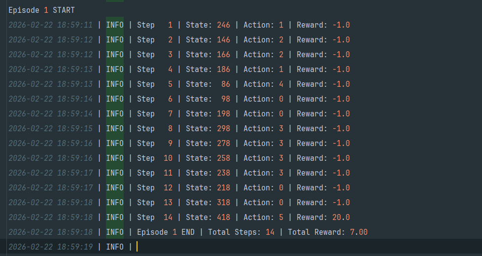

# CSCN8020 Assignment 2
##  Project Members:
    1. Jarius Bedward #8841640

## Project Summary:

This project is about working with the Taxi environment and implement QLearning and Deep Q-Learning. 
We test different hyperparameters and see which combination works better.

## Requirements:
    - Python 3.11
    - pip install -r requirements.txt
    

##  🎯  How to Run:

1. Clone this repo (git clone <repo-url> cd <repo-folder)
2. Install Required Dependencies: "pip install -r requirements.txt"
3. Open the jupyter notebook
4. Run all the cells within the notebook

## Workflow/Methodology:

The Taxi environment contains:
- 500 discrete states
- 6 discrete actions
- Reward structure:
  - -1 per step
  - +20 for correct passenger drop-off
  - -10 for illegal pickup or drop-off

The objective is to learn an optimal policy that maximizes cumulative reward by efficiently transporting passengers.

### Reinforcement Learning Formulation

- Agent: Taxi
- Environment: Taxi-v3 grid world
- State Space: 500 discrete states
- Action Space: 6 discrete actions
- Policy: ε-greedy
- Value Function: Q(s,a)
- Learning Type: Model-Free, Off-policy, Temporal Difference Learning

We use the Q-Learning update rule:

Q(s,a) ← Q(s,a) + α [r + γ max_a' Q(s',a') − Q(s,a)]

Where:
- α = learning rate
- γ = discount factor
- ε = exploration factor

## Log File Interpretation 
 In Q-Learning, thea gent updates it's action-value function using the Bellman Equation:

Q(s,a) ← Q(s,a) + α [ r + γ max Q(s',a') − Q(s,a) ]

In this experiment, I played around with different learning rates and exploration rates to see how they affected performance

### Learning  Rate
Based on the training logs:
Smaller learning rates resulted in very poor performance yielding large negative average returns where as the higher learning rates produced better average returns and fewer average steps.

 A higher learning rate (α = 0.2) led to faster convergence and better overall performance in this specific environment

In theory this makes sense since in the Taxi environment the only large positive reward(+20) occurs at the end of a successful episode. THis makes the reward delayed which means a higher learning rate allows the delayed reward to propagate backward through the Q-value quicker.

### Exploration Rate
As for exploration rate, that determines how often the agent chooses a random action to "explore".

With probability  ε > random action
With probability (1-ε) > greedy action

Based on the training logs
 
The ε = 0.2 performed better than 0.3
Increase the ε made the average return more negative.

This makes sense because the Taxi environment heavily penalizes illegal pickup/drop off(-10) and even has it so that the agent incurs -1 for just moving anywhere thats not the goal. More random actions, increase the chance of illegal moves and unnecessary steps. This increases penalties and lowers average returns

Based on the instructions provided I was tasked with picking out the best combination of hyperparameters between – Learning Rate α = [0.01, 0.001, 0.2] & Exploration Factor ε = [0.2, 0.3]

I found the best combination was one that balances update strength and controlled exploration.

### Simulation 

After training, I evaluated the learned Q-table using a greedy policy:
π(s) = argmaxₐ Q(s,a)

This means exploration was turned off, no further learning updates occurred and the agent only followed the learned policy

The simulation log shows no illegal moves occurred, there was consistent navigation directly to the passenger and destination and successful completion of every episode (didn't hit the taxi env 200 step limit)

An example: 

Even though the average return during training was negative, this is expected due to early episodes since they were highly  exploratory and accumulated large penalties.  The simulation results confirm the agent learned a near-optimal policy that minimizes steps and avoids illegal  actions.

## Workflow Conclusion

- The training experiments demonstrate that Q-Learning performance is highly  sensitive to hyperparameters

- The simulation results confirm that the leaned Q-table represents an efficient and near optimal policy for solving the Taxi-Environment but can be continued to be tuned for the optimal policy

## Extra Notes:

- I wrote talking points in the markdown cells for the jupyter notebook. The PDF contains the exact same talking points just organized in a PDF format for easier viewing.

- The code generates the log file when trained and when the simulation happens so it will probably be different when you run it as I did not include the log files to the github repo.

- There is a extra code cell at the bottom of the notebook it's a small simulation (5 episodes) of how the training goes and shoes how the taxi agent runs into the walls. I didn't include it in the main part of the code because it takes forever even to complete it but if you want to run it just un comment it out and run the full code again.

# 🤝 Contributing
- This is an Assignment developed for CSCN8020. If any questions arise do not hesitate to contact the project member.

